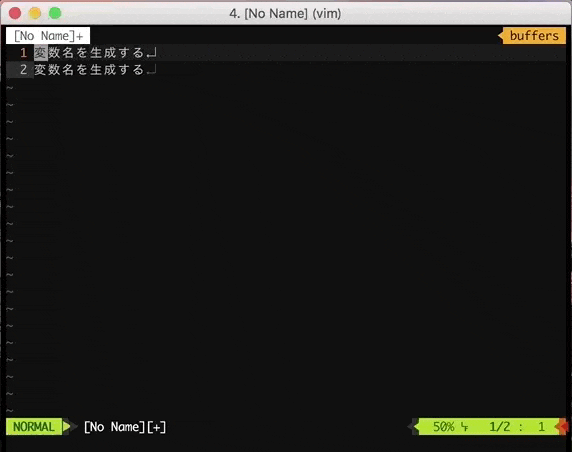

# [CODIC](https://codic.jp/) for Vim



* Install Requirement

```bash
$ pip3 install requests
```

* GET API_TOKEN
  * https://codic.jp/my/api_status

```bash
$ mkdir -p ~/.config/codic
$ echo YOUR_API_TOKEN > ~/.config/codic/api_token
```

* Edit vimrc

```vim
" NeoBundle
NeoBundle 'okwrtdsh/vim-codic'

" dein
call dein#add('okwrtdsh/vim-codic')
```

